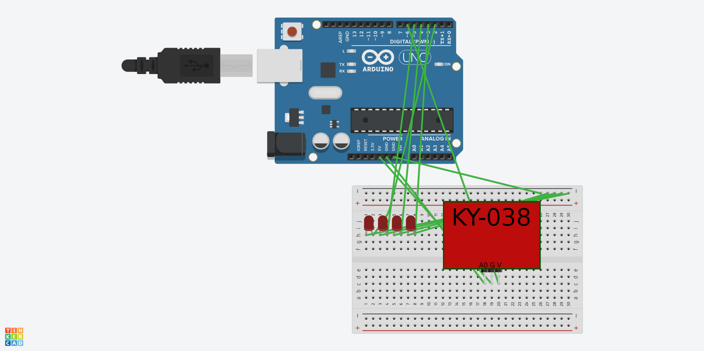
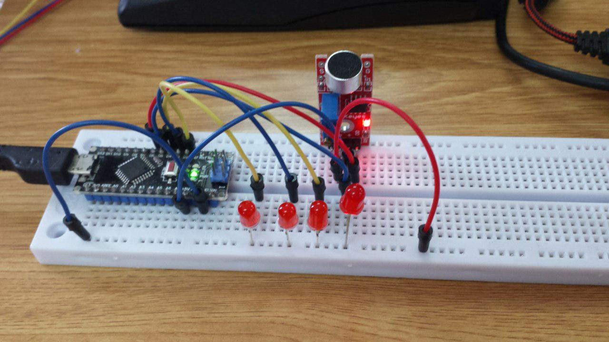

# Practica 5B: Clap Switch

## Componentes

* Arduino Nano
* 4 LEDs
* Sensor sonido "Big Sound" KY-038

## Finalidad del proyecto

Encender y apagar 4 LEDs dando palmadas:
* 2 palmadas encienden/apagan el LED 1
* 3 palmadas encienden/apagan el LED 2
* 4 palmadas encienden/apagan el LED 3
* 5 palmadas encienden/apagan el LED 4
* 6 palmadas apagan todos los LEDs

## Funcionamiento del módulo KY-038

Este módulo se alimenta con 5V y tiene dos salidas, una analógica y otra digital.

La salida analógica es el nivel de sonido instantáneo que detecta el micrófono.

La salida digital por defecto está en nivel bajo. Sube a nivel alto durante un breve período de tiempo cuando el micrófono detecta un valor superior al umbral, que se puede regular ajustando el potenciómetro que incluye la placa del sensor.

## Funcionamiento

* Se declara una constante "tiempo clap": el tiempo que debe pasar desde la última palmada detectada para realizar la acción pertinente dependiendo del número de palmadas dadas (1.5seg en nuestro caso)
* Se define un array de 4 _const int_ global con los pines de los LED
* Se define un array de 4 _bool_ global para guardar
* Se define una variable _bool_ global para guardar el estado de los 4 LEDs (encendido o apagado)
* Se define un _unsigned int_ "contador" para contar el número de palmadas dadas
* Se define un _unsigned long_ "lastClap" para almacenar el instante de la última palmada (millis)
* Se definen los 4 LED como salida
* Se define el pin 3 como entrada digital (salida del módulo)
* En el _loop_:
	* Se guarda el tiempo actual de ejecucion ("currentMillis" con la función millis() de Arduino)
	* Se comprueba si la entrada digital salida del módulo está en nivel alto (es decir, se detectó una palmada), en cuyo caso:
		1. se guarda el tiempo _currentMillis_ en _lastClap_
		2. se aumenta +1 el _contador_
		3. se esperan 200ms
	* Se comprueba si pasaron más de _tiempo clap_ segundos, en cuyo caso:
		1. si _contador_ está entre 2 y 6:
			* si _contador_ está en 6:
				* para cada uno de los LED:
					1. se cambia su estado a _apagado_
					2. se guarda el estado _apagado_ en el array de estados
			* sino:
				1. se calcula el index del LED: contador-2 (porque 2 palmadas equivalen al primer LED, que es el index 0 de los arrays de LEDs)
				2. se obtiene el estado al que se debe poner el LED (es el contrario del estado guardado en el array de estados)
				3. se cambia el estado del LED al estado obtenido en el punto 2
				4. se guarda el estado actual en el array de estados
		2. se reinicia _contador_ a 0

## Vídeo

[Vídeo demostrativo Youtube](https://youtu.be/9hFchaz6scQ)

## Circuito

## Foto montaje

